# WH40K Terrain Layout

Offline Windows and Android companion for finding the official Warhammer 40,000 terrain map for a match. Choose both players' Force Dispositions and layout A, B, or C; the app shows the corresponding terrain placement diagram, assigned missions, and detailed scoring references.

**Current source version:** v0.5.0

**Latest published release:** [v0.5.0](https://github.com/okami69/WH40K-Terrain-Layout/releases/tag/v0.5.0)

Everything needed at the table is bundled with the application, so it works without an internet connection after installation. The interface supports Russian and English, includes the official Layouts Key and Terrain Layouts rules, and can enlarge any map for closer inspection.

## What's new in v0.5.0

- Added optional Twists, defaulting to **No Twist**. The six choices follow the current official Warhammer 40,000 app order: Martial Pride, Mirrored World, Night Fighting, Nowhere to Hide, Ruinscape, and Scrambled Communications.
- Supports choosing a named Twist, selecting one at random, returning to No Twist, and reviewing the selected Twist's full effects.
- Expanded mission references with scoring conditions, timing, per-condition VP, and the 45 VP total / 15 VP per battle round limit where applicable.
- Made Force Disposition menus open in a deterministic centered position and balanced the map and controls in portrait layouts.

## Features

- Resolves the terrain map from two Force Dispositions and layout A, B, or C.
- Shows each assigned mission's detailed RU/ENG scoring conditions, timing, VP values, and applicable limits.
- Offers the six optional Twists in official order with named, random, and No Twist selection; No Twist is the default.
- Includes the official Terrain Layouts rules, recommended terrain footprints, and Layouts Key from Event Companion v1.1.
- Opens each terrain map in a full-size viewer.
- Opens a large-preview gallery to use any of the 45 bundled terrain maps without changing the selected missions.
- Remembers the selected language and follows the OS language on first launch.
- Runs offline in a compact Windows desktop window or a portrait-only Android phone view.
- Uses a denser portrait-phone layout so the main map fills more of the available screen.

## Screenshots

All screenshots below use the English interface and were captured from the verified v0.5.0 source.

### Desktop

| Main screen | Force Disposition menu |
| --- | --- |
| 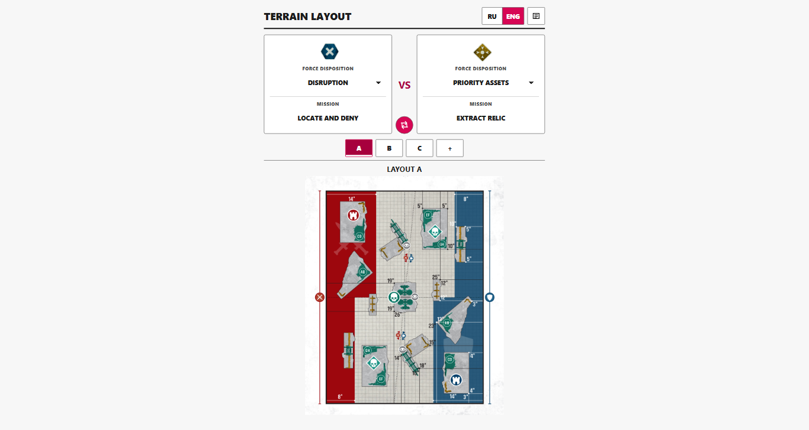 | 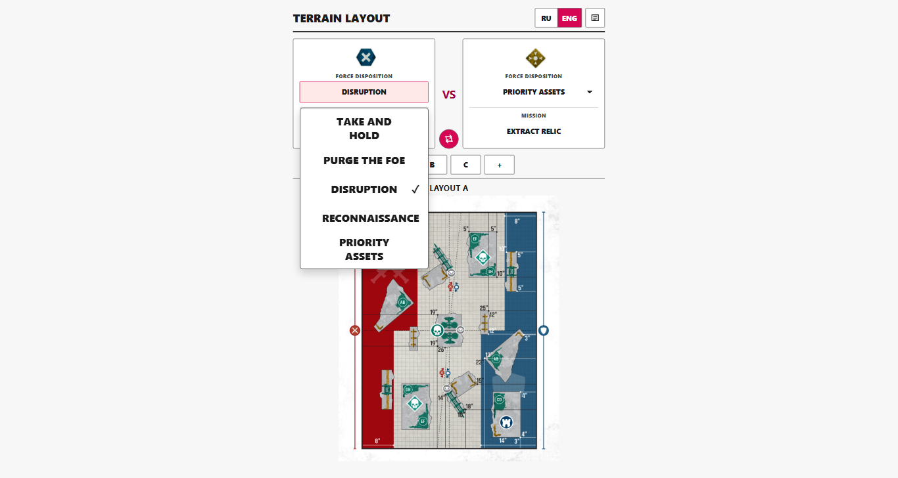 |
| Mission details | Twist chooser |
| 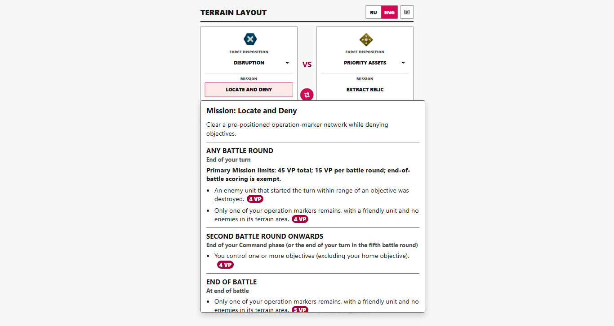 | 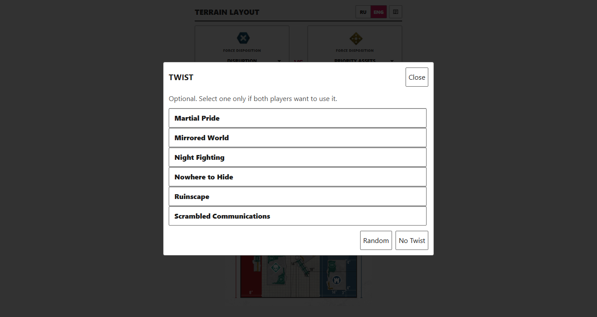 |
| Selected Twist | Layouts Key |
| 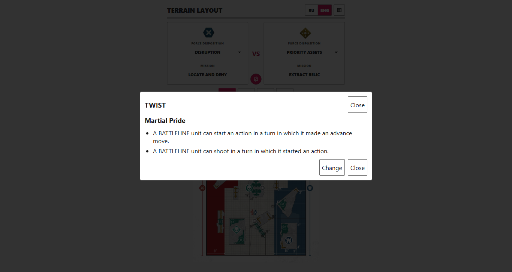 | 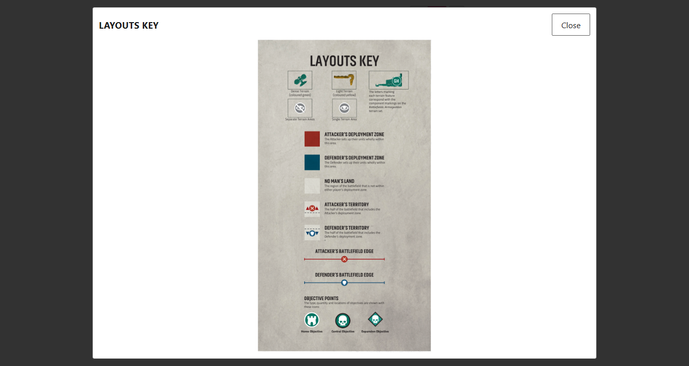 |
| Terrain Layout rules | All-layout gallery |
| 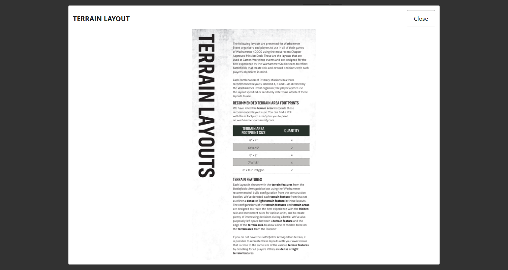 | 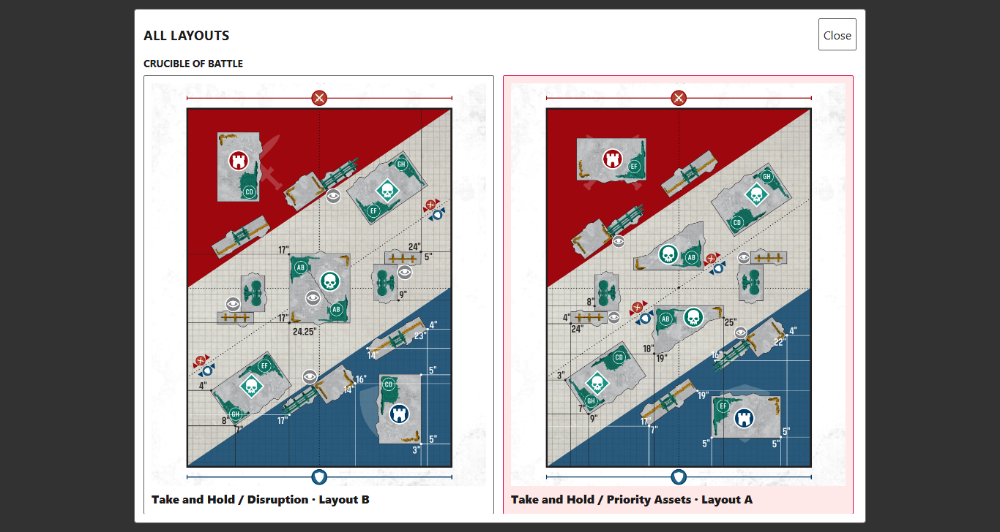 |
| Enlarged map | |
| 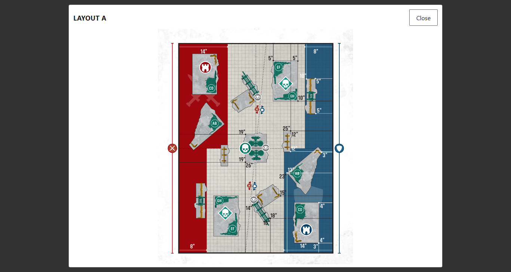 | |

### Mobile

| Main screen | Force Disposition menu |
| --- | --- |
| 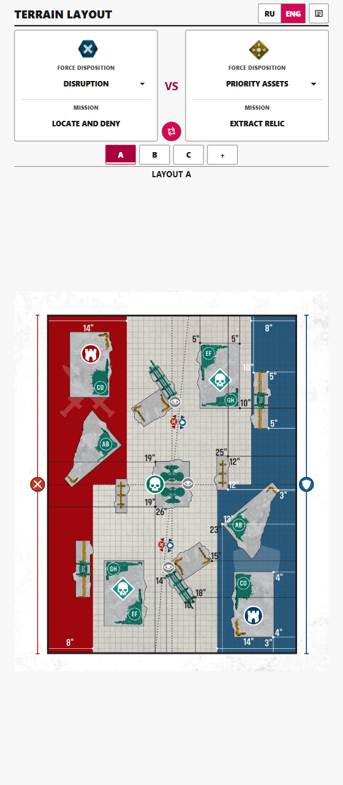 | 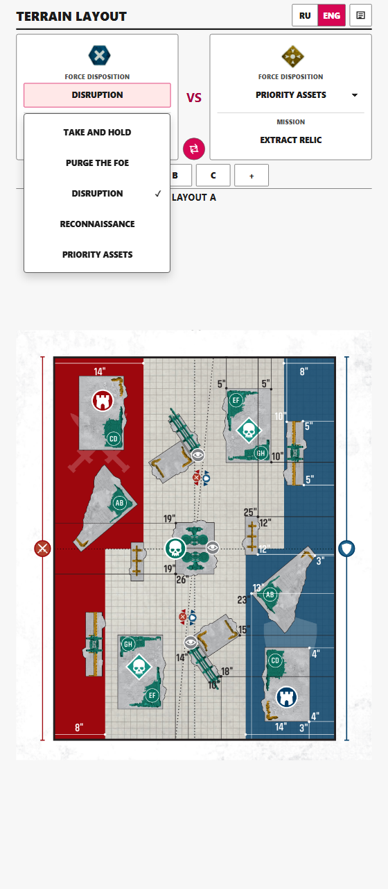 |
| Mission details | Twist chooser |
| 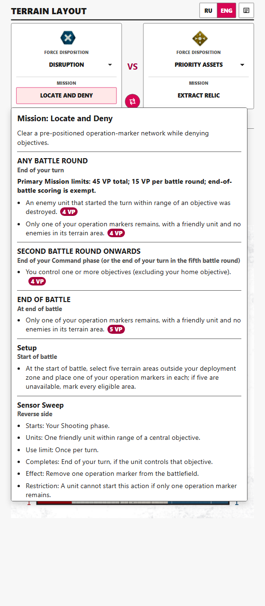 | 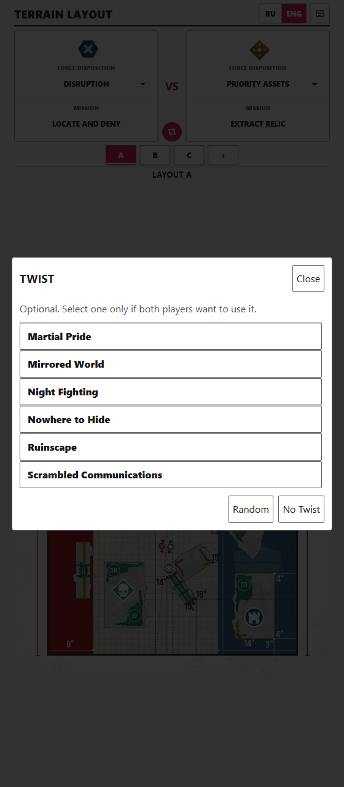 |
| Selected Twist | |
| 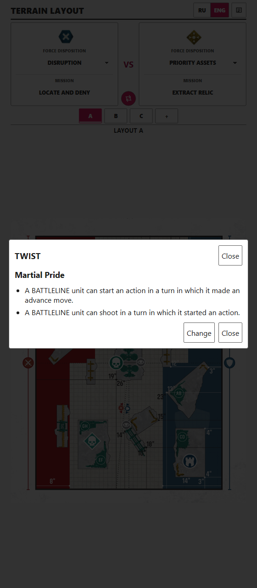 | |

## Download

Download the signed **Android ARM64** APK from the [v0.5.0 release](https://github.com/okami69/WH40K-Terrain-Layout/releases/tag/v0.5.0). It is intended for direct installation on modern ARM64 phones without Google Play: download the APK, allow installation from the browser or file manager when Android asks, then open it normally. The Android build is portrait-only, works offline, and packages the original lossless WebP map assets without further resizing. It was physically verified on a OnePlus 15R by the project owner and checked at 320 x 568, 360 x 800, 412 x 915, 480 x 1040, 560 x 1280, and 768 x 1080 portrait viewports.

The Windows x64 NSIS installer is available from the [v0.5.0 release](https://github.com/okami69/WH40K-Terrain-Layout/releases/tag/v0.5.0). It uses the Windows WebView2 Runtime and downloads it only if it is not already present.

## v0.5.0 verification

The following v0.5.0 release artifacts were built and checked locally before publication.

- Windows application: `src-tauri/target/release/wh40k-terrain-layout.exe` — 24,181,248 bytes; SHA-256 `23360C5F73DCD4B775FD67985A35DD5B5EA0F1760C13A4EB90032C3CFB046A89`.
- Windows NSIS installer: `src-tauri/target/release/bundle/nsis/WH40K Terrain Layout_0.5.0_x64-setup.exe` — 22,053,157 bytes; SHA-256 `AA902340A9E3EBFA0436EDE7D6291C79639DBCC28C4B813F36F2A4CC3F28E2A6`. Both Windows binaries report version `0.5.0`; neither is Authenticode-signed.
- Signed Android ARM64 release APK: source `src-tauri/gen/android/app/build/outputs/apk/arm64/release/app-arm64-release.apk`; stable copy `output/android/WH40K-Terrain-Layout-v0.5.0-arm64-release.apk` — 32,141,462 bytes; SHA-256 `66DCD9EB642077C8D64FE518E29AD1B2FF7A5020D2E41913866E270A12490BE8`.
- APK verification: application ID `com.okami69.wh40kterrainlayout`, version name `0.5.0`, version code `5000`, only `arm64-v8a`, APK Signature Scheme v2 verified, and signer certificate SHA-256 `f26b5207728358d27b718e47c1e09e02c3c80c181b71fb73ca1f34607807ca54` matching v0.4.0. No v3 signature is present.

Automated acceptance passed 60 Node tests and Chromium checks at 320×568, 360×800, 412×915, 480×1040, 560×1280, 768×1080, and 1366×728. The packaged Windows executable launched successfully, and the final Android build passed physical-device verification.

## Use

1. Select each player's Force Disposition from the two top cards.
2. Choose layout A, B, or C.
3. Use `+` to open the scrollable all-layout gallery; choosing a free map does not change either Force Disposition or mission.
4. Leave the centered Twist control at No Twist, choose one of the six named Twists in official order, or use Random; reopen the control to review or change the selection.
5. Hover, focus, click, or tap a mission name for its detailed RU/ENG scoring and VP reference.
6. Use the key icon for the official layouts key, or click the map for the enlarged map viewer.

The UI switches between RU and ENG. First launch follows the OS language when it starts with `ru`; explicit RU/ENG clicks are saved locally. Official map, key, and rules images remain English because they are packaged from Event Companion v1.1.

## How it is built

The Windows and Android applications use a minimal [Tauri 2](https://tauri.app/) shell around a shared dependency-free frontend written in plain HTML, CSS, and JavaScript. All maps, disposition icons, rules, translations, and matchup data are packaged locally as static assets; no server or account is required at runtime.

## Develop and build

Prerequisites:

- Node.js with npm
- Rust stable MSVC toolchain
- Microsoft Visual Studio 2022 Build Tools with `Microsoft.VisualStudio.Workload.VCTools`
- WebView2 Runtime
- Microsoft OpenJDK 21, Android SDK 36, Build Tools 36.0.0, NDK r29, and the Rust `aarch64-linux-android` target for Android builds
- Python only when re-extracting PDF assets

```powershell
npm.cmd install
npm.cmd test
npm.cmd start
npm.cmd run dist
npm.cmd run android:init
npm.cmd run android:build
```

The Tauri NSIS installer is written under:

`src-tauri/target/release/bundle/nsis/`

The signed Android APK is written under `src-tauri/gen/android/app/build/outputs/apk/arm64/release/`. Release signing requires the ignored `src-tauri/gen/android/keystore.properties` file and the external private keystore it references. Never commit either file. Keep a secure backup of the same keystore and password: both are required to publish installable upgrades. On Windows, Android builds also require Developer Mode or an elevated shell because Tauri creates JNI symbolic links.

Published v0.5.0 verification covers the Node test suite, signed APK verification, ARM64-only native contents, packaged offline assets, responsive Playwright checks, the packaged Windows launch, and a physical Android smoke test.

## Re-extract assets

Place Event Companion v1.1 at the repository root with this exact filename:

`eng_22_07_warhammer_40,000_event_companion_alyapl19us_b2drgwkji4.pdf`

Then run:

```powershell
& 'C:\Users\okami\.cache\codex-runtimes\codex-primary-runtime\dependencies\python\python.exe' -m pip install -r tools/requirements.txt
& 'C:\Users\okami\.cache\codex-runtimes\codex-primary-runtime\dependencies\python\python.exe' tools/extract_layouts.py
```

The extractor writes 45 lossless WebP maps, five disposition icons, `app/assets/key/layouts-key.webp`, and `app/assets/backgrounds/event-companion-paper.webp`. The older June Event Companion is not used.

## Project structure

- `app/` - shared offline web UI and packaged WebP assets
- `src-tauri/` - shared Tauri 2 Windows and Android shell
- `test/` - Node static/behavior tests
- `tools/` - optional PDF extraction script
- `docs/superpowers/` - approved design and implementation records

See the [Android v0.3 design specification](docs/superpowers/specs/2026-08-08-android-arm64-apk-design.md), [Android v0.3 implementation plan](docs/superpowers/plans/2026-08-08-android-arm64-apk-implementation.md), and [GitHub issue #7](https://github.com/okami69/WH40K-Terrain-Layout/issues/7).
